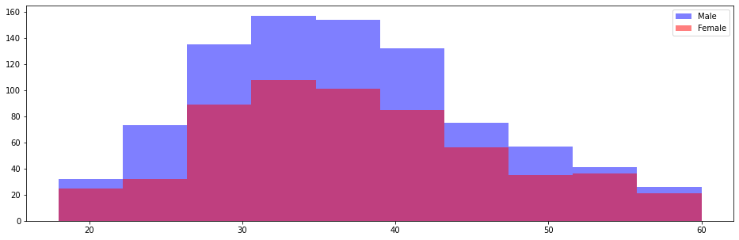
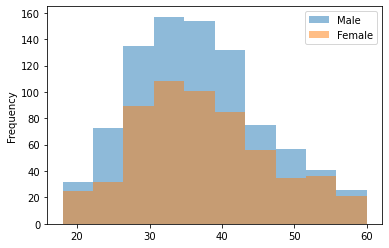
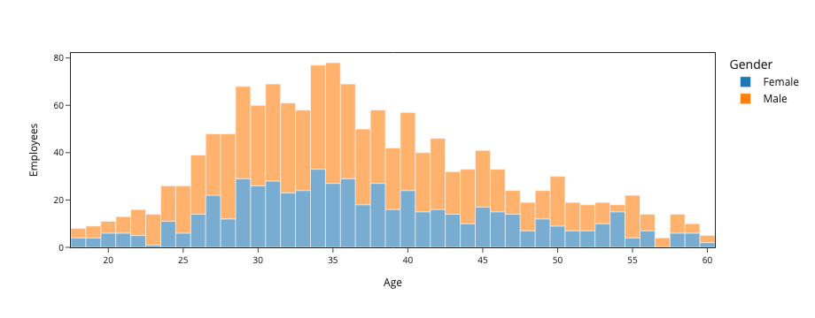
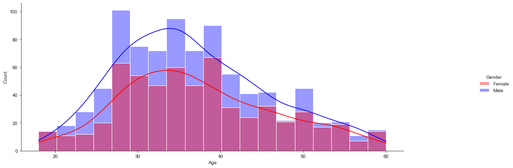

# Data Visualization - IBM Employees and Covid

  <em>Exploratory Data Visual Analysis on IBM Employees and Covid data.</em>

 

## 📖 Project

### 👨🏻‍🏫 Introduction

A visual exploratory exercise on two datasets: **IBM Employees** and **Sao Paulo State 2020 Covid Data** using:

- Scatter Plots with multiple colors.
- Time Series.
- Pie Plots ([Sorry, Ms. Knaflic.](https://www.amazon.com.br/Storytelling-Data-Visualization-Business-Professionals/dp/1119002257/ref=asc_df_1119002257/?tag=googleshopp00-20&linkCode=df0&hvadid=379787555408&hvpos=&hvnetw=g&hvrand=2793399920721159232&hvpone=&hvptwo=&hvqmt=&hvdev=c&hvdvcmdl=&hvlocint=&hvlocphy=1031858&hvtargid=pla-404294414086&psc=1)).
- Bar Plots.
- Histograms.
- Boxplots.

### 🎯 Goal

Develop the same plots on four different python data visualization libraries: **pandas visualization**, **matplotlib**, **plotly**, and **seaborn**.

### 📊 Chart Example

### On Matplotlib

### On Pandas

### On Plotly

### On Seaborn

## 🗄 Notebooks

- [1.0-matplotlib.ipynb](notebooks/1.0-matplotlib.ipynb)
- [1.0-pandas_visualization.ipynb](notebooks/1.0-pandas_visualization.ipynb)
- [1.0-plotly.ipynb](notebooks/1.0-plotly.ipynb)
- [1.0-seaborn.ipynb](notebooks/1.0-seaborn.ipynb)

## 📈 Features

### DataFrame 1: IBM Employees

| Columns                  | Description                                             |
|--------------------------|---------------------------------------------------------|
| Age                      | Age                                                     |
| Attrition                | Indicates if employee left the company or not           |
| BusinessTravel           | Business travel frequency                               |
| DailyRate                | Employee cost per day                                   |
| Department               | Department                                              |
| DistanceFromHome         | Distance from employee's home to the company            |
| Education                | Education degree                                        |
| EducationField           | Education field                                         |
| EmployeeNumber           | Employee ID                                             |
| Gender                   | Gender                                                  |
| EnvironmentSatisfaction  | Satisfaction with the working environment               |
| HourlyRate               | Employee earnings per hour                              |
| JobInvolvement           | Emotionally satisfaction with the working environment   |
| JobLevel                 | Employee level                                          |
| JobRole                  | Employee role                                           |
| JobSatisfaction          | Job satisfaction                                        |
| MaritalStatus            | Marital Status                                          |
| NumCompaniesWorked       | Number of companies the employee worked before          |
| PercentSalaryHike        | Salary increasing (percent)                             |
| PerformanceRating        | Employee performance rating                             |
| RelationshipSatisfaction | Working relationships satisfaction level                |
| TotalWorkingYears        | Total working years of the employee                     |
| TrainingTimesLastYear    | Number of training the employee attended last year      |
| WorkLifeBalance          | Work life balance satisfaction in employee's view       |
| YearsAtCompany           | Total working years of the employee in the company      |
| YearsInCurrentRole       | Total working years of the employee in the current role |
| YearsSinceLastPromotion  | Total working years since employee's last promotion     |
| YearsWithCurrManager     | Total working years with employee's current manager     |

### DataFrame 2: Sao Paulo State 2020 Covid Data

| Column        | Description                                    |
|---------------|------------------------------------------------|
| nome_munic    | City name                                      |
| codigo_ibge   | City code                                      |
| casos_novos   | New covid cases registered in the date         |
| obitos_novos: | Deaths caused by covid registered in the date  |
| nome_drs      | Regional Health Department (DRS) name          |
| cod_drs       | Regional Health Department (DRS) code          |
| pop           | City population (estimate)                     |
| pop60         | City population of 60+ years of age (estimate) |
| ano_mes       | Date on YYYY_MM format                         |

## 📦 Folder Structure

    ├── LICENSE
    ├── README.md          <- The top-level README for developers using this project.
    ├── data
    │   └── raw            <- The original, immutable data dump.
    │
    ├── notebooks          <- Jupyter notebooks. Naming convention is a number (for ordering),
    │                         and a short `-` delimited description, e.g.
    │                         `1.0--creating-the-model.ipynb`.
    ├── references         <- images, reports, and other resources for the project